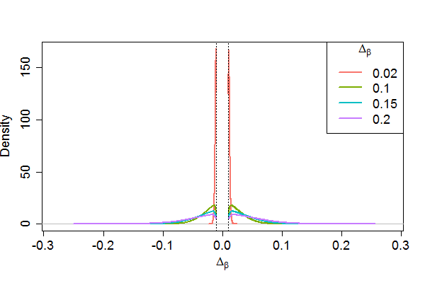
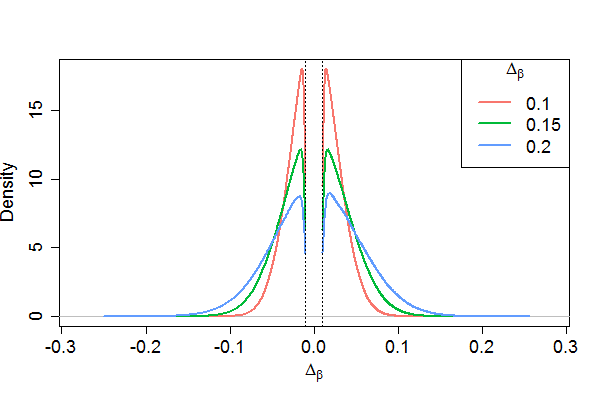

# Introduction

When designing an epigenome-wide association study (EWAS) to investigate the relationship between DNA methylation (DNAm) and some exposure(s) or phenotype(s), it is critically important to assess the sample size needed to detect a hypothesized difference with adequate statistical power. However, the complex and nuanced nature of DNAm data makes direct assessment of statistical power challenging. To circumvent these challenges and to address the outstanding need for a user-friendly interface for EWAS power evaluation, we have developed pwrEWAS. The current implementation of pwrEWAS accommodates power estimation for two-group comparisons of DNAm (e.g. case vs control, exposed vs non-exposed, etc.), where methylation assessment is carried out using the Illumina Human Methylation BeadChip technology. Power is calculated using a semi-parametric simulation-based approach in which DNAm data is randomly generated from beta-distributions using CpG-specific means and variances estimated from one of several different existing DNAm data sets, chosen to cover the most common tissue-types used in EWAS. In addition to specifying the tissue type to be used for DNAm profiling, users are required to specify the sample size, number of differentially methylated CpGs, effect size(s), target false discovery rate (FDR) and the number of simulated data sets, and have the option of selecting from several different statistical methods to perform differential methylation analyses. pwrEWAS reports the marginal power, marginal type I error rate, marginal FDR, and false discovery cost (FDC).
The R-Shiny web inter-face allows for easy input of user-defined parameters and includes an advanced settings button that offers additional options pertaining to data generation and computation. 


## Installation
pwrEWAS can be installed from guthub with the following R code:
```{r install, warning=FALSE, message=FALSE, eval=FALSE}
if (!requireNamespace("BiocManager"))
    install.packages("BiocManager")
BiocManager::install("pwrEWAS")
```

```{r library, warning=FALSE, message=FALSE, eval=TRUE}
library("pwrEWAS")
```


\newpage
# Usage
To execute the main pwrEWAS function the following to codes can be used. pwrEWAS allows the user to specify the effect size in one of two ways, by either providing a target maximal difference in methylation ("targetDelta"), or by providing the standard deviation of the simulated differnces ("deltaSD"). Only one of both arguments can be provided. If "targetDelta" is specified, pwrEWAS will automatically identify a standard deviation to simulate differences in methylation, such that the 99.99th percentile of the absolute value of simulated differences falls within a range around the targeted maximal difference in DNAm (see paper for additional details). If "deltaSD" is specified, pwrEWAS will simulate differences in methylation using the provided standard deviation (additional information provided in paper).

```{r usage, warning=FALSE, message=FALSE, eval=TRUE, results="hide"}
# providing the targeted maximal difference in DNAm
results_targetDelta = pwrEWAS(minTotSampleSize = 10,
                    maxTotSampleSize = 50,
                    SampleSizeSteps = 10,
                    NcntPer = 0.5,
                    targetDelta = c(0.2, 0.5),
                    J = 100,
                    targetDmCpGs = 10,
                    tissueType = "Adult (PBMC)",
                    detectionLimit = 0.01,
                    DMmethod = "limma",
                    FDRcritVal = 0.05,
                    core = 4,
                    sims = 50)

# providing the targeted maximal difference in DNAm
results_deltaSD = pwrEWAS(minTotSampleSize = 10,
                    maxTotSampleSize = 50,
                    SampleSizeSteps = 10,
                    NcntPer = 0.5,
                    deltaSD = c(0.02, 0.05),
                    J = 100,
                    targetDmCpGs = 10,
                    tissueType = "Adult (PBMC)",
                    detectionLimit = 0.01,
                    DMmethod = "limma",
                    FDRcritVal = 0.05,
                    core = 4,
                    sims = 50)

```

\newpage
## Input parameter 
<!-- https://www.tablesgenerator.com/markdown_tables -->
The following table provides a description of the input arguments:

| Parameter | Description |
|------------------|---------------------------------------------------------------------------------|
| minTotSampleSize | Lowest total sample sizes to be considered |
| maxTotSampleSize | Highest total sample sizes to be considered |
| SampleSizeSteps | Steps with which total sample size increases from minTotSampleSize to maxTotSampleSize |
| NcntPer | Rate by which the total sample size is split into groups (0.5 corresponds to a balanced study; rate for group 2 is equal to 1 rate of group 1) |
| targetDelta | Standard deviations of the simulated differences is automatically determined such that the 99%til of the simulated differences are within a range around the provided values |
| deltaSD | Differences in methylation will be simulated using provided standard deviation |
| J | Number of CpG site that will simulated and tested (increasing Number of CpGs tested will require increasing RAM (memory)) |
| targetDmCpGs | Target number of CpGs simulated with meaningful differences (differences greater than detection limit) |
| tissueType | Heterogeneity of different tissue types can have effects on the results. Please select your tissue type of interest or one you believe is the closest |
| detectionLimit | Limit to detect changes in methylation. Simulated differences below the detection limit will not be consider as meaningful differentially methylated CpGs |
| DMmethod | Method used to perform differential methylation analysis |
| FDRcritVal | Critical value to control the False Discovery Rate (FDR) using the Benjamini and Hochberg method |
| core | Number of cores used to run multiple threads. Ideally, the number of different total samples sizes multiplied by the number of effect sizes should be a multiple (m) of the number of cores (#sampleSizes * #effectSizes = m * #threads). An increasing number of threads will require an increasing amount of RAM (memory) |
| sims | Number of repeated simulation/simulated data sets under the same conditions for consistent results |


## Output parameter
Running pwrEWAS will result in an object with the following four attributes: meanPower, powerArray, deltaArray, and metric. The first attribute ''meanPower'' is a 2D matrix with empirically estimated marginal mean power for sample sizes and target $\Delta_\beta$s (averaged over simulated data sets). The second attribute ''powerArray'' provides the full set of empirically estimated marginal power for sample sizes and target $\Delta_\beta$s for each simulated data sets in a 3D matrix. The third attribute ''deltaArray'' contains a 3D matrix with simulated $\Delta_\beta$s for sample sizes, target $\Delta_\beta$, and simulated data sets. The last attribute ''metric'' contains 2D matrices with the marginal type I error rate (marTypeI), power in the classical sense (classicalPower), actual FDR (FDR), False Discovery Cost (FDC), and probabilities of identifying at least one true positive in table format, where sample sizes are shown as rows and effect sizes are columns. Examples results can be found in the example section.


# Runtime
In general, the computational complexity of pwrEWAS depends on four major components: (1) assumed number and magnitude of sample size(s), (2) number of target $\Delta_\beta$'s (effect sizes), (3) number of CpGs tested, and (4) number of simulated data sets. To enhance the computational efficiency, pwrEWAS allows users to process simulations in parallel. While (1) and (2) are usually dictated by the study to be conducted, (3) and (4) can be modified to either increase the precision of power estimates (increased run time) or reduce the computational burden (decreased precision of estimates). The following table provides the run time of pwrEWAS for different combinations of sample sizes and effect sizes. In all scenarios presented the number of tested CpGs was assumed to be 100,000, number of simulated data sets was 50, and the method to perform the differential methylation analysis as limma. A total of 6 clusters/threads were used.

| Total sample size \ Effect size $\Delta_\beta$ | 0.1         | 0.1, 0.2    | 0.1, 0.3, 0.5 |
|------------------------------------------------|-------------|-------------|---------------|
| 10                                             | 2min 21sec  | 3min 11sec  | 3min 50sec    |
| 100                                            | 6min 22sec  | 7min 39sec  | 8min 33sec    |
| 500                                            | 24min 43sec | 27min 36sec | 29min 22sec   |
| 10-100 (increments of 10)                      | 9min 40sec  | 16min 34sec | 23min 44sec   |
| 300-500 (increments of 100)                    | 27min 58sec | 30min 01sec | 52min 00sec   |


# Example

## Running pwrEWAS
Running pwrEWAS by providing target maximal difference in methylation or by providing standard deviation of difference in methylation:
```{r example running pwrEWAS targetDelta, warning=FALSE, message=FALSE, eval=FALSE, results="hide"}
library(pwrEWAS)
set.seed(1234)
results_targetDelta = pwrEWAS(minTotSampleSize = 20,
                    maxTotSampleSize = 260, 
                    SampleSizeSteps = 40,
                    NcntPer = 0.5,
                    targetDelta = c(0.02, 0.10, 0.15, 0.20),
                    J = 100000, 
                    targetDmCpGs = 2500, 
                    tissueType = "Blood adult",
                    detectionLimit = 0.01,
                    DMmethod = "limma",
                    FDRcritVal = 0.05,
                    core = 4,
                    sims = 50)

results_deltaSD = pwrEWAS(minTotSampleSize = 20,
                    maxTotSampleSize = 260, 
                    SampleSizeSteps = 40,
                    NcntPer = 0.5,
                    deltaSD = c(0.00390625, 0.02734375, 0.0390625, 0.052734375),
                    J = 100000, 
                    targetDmCpGs = 2500, 
                    tissueType = "Blood adult",
                    detectionLimit = 0.01,
                    DMmethod = "limma",
                    FDRcritVal = 0.05,
                    core = 4,
                    sims = 50)

```

<!-- save(results_targetDelta, file = "vignette.Rdata") --> 
```{r echo=FALSE, results='hide',message=FALSE}
load("vignette_reduced.Rdata")
```


If pwrEWAS is executed with providing target maximal difference, first $\tau$ will be determined. The beginning and finish of this process will be printed with time stamps (see below for an example). If the standard deviation of difference is provided, this step will be skipped. \\
Next, pwrEWAS will run the simulations to empirically estimate power. pwrEWAS will indicate when the simulations are started. To monitor the process pwrEWAS will display a process bar. pwrEWAS will print a statement including a time stamps once finished (see below for an example).

```{r example running pwrEWAS targetDelta time stamps, warning=FALSE, message=FALSE, eval=TRUE}
## [2019-02-12 18:40:23] Finding tau...done [2019-02-12 18:42:53]
## [1] "The following taus were chosen: 0.00390625, 0.02734375, 0.0390625, 0.052734375"
## [2019-02-12 18:42:53] Running simulation
## |===================================================================| 100%
## [2019-02-12 18:42:53] Running simulation ... done [2019-02-12 19:27:03]
```


## Outputs 
Running pwrEWAS will result in an object, that stores the following four attributes:
```{r example results_targetDelta str, warning=FALSE, message=FALSE, eval=TRUE}
attributes(results_targetDelta)
## $names
## [1] "meanPower" "powerArray" "deltaArray" "metric"
```

### meanPower 
The primary results will be provided in the attribute ''meanPower''. It is essentially a summary of the attribute ''powerArray''. meanPower will be provide a `r paste(dim(results_targetDelta$meanPower), collapse = "x")` table with the average power by total sample size as rows (here 20-260 patients with increments of 40) and by target $\Delta_\beta$, if ''targetDelta'' was provided, or ''$SD(\Delta_\beta)$'', if deltaSD was provided, as columns (here targetDelta was provided as: `r paste(colnames(results_targetDelta$meanPower), collapse = ", ")`):
```{r example results_targetDeltaput mean power, warning=FALSE, message=FALSE, eval=TRUE}
dim(results_targetDelta$meanPower)
print(results_targetDelta$meanPower)
```

### powerArray 
The attribute ''powerArray'' should primarily be used to create a power plot but can also be used to investigate the power results for the individual simulations. pwrEWAS includes a function ''pwrEWAS_powerPlot'' that will create a power plot, where power (y-axis) is shown as a function of sample sizes (x-axis) for different effect sizes (color coded). For each sample size, the mean power as well as the 95%tile interval (2.5% and 97.5%) is shown. ''sd'' should be set to ''FALSE'' if ''targetDelta'' was specified in pwrEWAS, and ''TRUE'' if ''deltaSD'' was specified in pwrEWAS.

```{r example power plot, warning=FALSE, message=FALSE, eval=TRUE}
dim(results_targetDelta$powerArray) # simulations x sample sizes x effect sizes
pwrEWAS_powerPlot(results_targetDelta$powerArray, sd = FALSE)
```

### deltaArray 
The third attribute ''deltaArray'' contains the simulated differences in mean DNAm. Each $\Delta_\beta$ is drawn from a truncated normal, where either the standard devation is provided (''deltaSD'') or automatically determined based on the user-specified target $\Delta_\beta$ (''targetDelta'') and the expected number of differentially methylated CpGs (''targetDmCpGs''). To automatically determined the standard devation, it is adjusted stepwise until the 99.99th percentile of the absolute value of simulated $\Delta_\beta$s falls within a range around the targeted maximal difference in DNAm (see paper for additional details). The maximal value of $\Delta_\beta$ can exceed the user-specified target $\Delta_\beta$, but about 99.99\% of simulated differences will be below user-specified target $\Delta_\beta$ (as seen below):

```{r example max delta, warning=FALSE, message=FALSE, eval=FALSE}
# maximum value of simulated differences by target value
lapply(results_targetDelta$deltaArray, max)
## $`0.02`
## [1] 0.02095302
##
## $`0.1`
## [1] 0.1265494
##
## $`0.15`
## [1] 0.2045638
##
## $`0.2`
## [1] 0.2458416

# percentage of simulated differences to be within the target range
mean(results _ targetDelta$deltaArray[[1]] < 0.02)
## [1] 0.9999999
mean(results _ targetDelta$deltaArray[[2]] < 0.10)
## [1] 0.9998882
mean(results _ targetDelta$deltaArray[[3]] < 0.15)
## [1] 0.9999386
mean(results _ targetDelta$deltaArray[[4]] < 0.20)
## [1] 0.9999539
```

To get a better understanding of how the differences in mean DNAm are distributed, pwrEWAS provides a density plot, where the distribution of simulated differences in mean DNAm is plotted by target differences in DNAm ($\Delta_\beta$). The color theme matches the colors of the power plot. Simulated differences within the detection limit around zero are removed, as they are here not defined as meaningful differences. ''sd'' should be set to ''FALSE'' if ''targetDelta'' was specified in pwrEWAS, and ''TRUE'' if ''deltaSD'' was specified in pwrEWAS. 
\newpage
```{r example density plot, warning=FALSE, message=FALSE, eval=FALSE}
pwrEWAS_deltaDensity(results_targetDelta$deltaArray, detectionLimit = 0.01, sd = FALSE)
```


In the figure above, the densities are very compress, because the first effect size is clearly different from the other three. The following code will provide the figure after removing the first effect size:
```{r example density plot w/o 0.02, warning=FALSE, message=FALSE, eval=FALSE}
temp = results_targetDelta$deltaArray
temp[[1]] = NULL
pwrEWAS_deltaDensity(temp, detectionLimit = 0.01, sd = FALSE)
```




\newpage
### metric 
The fourth attribute ''metric'' contains tables on marginal type I error rate (''marTypeI''), power in the classical sense (classicalPower), actual FDR (FDR), False Discovery Cost (FDC, see paper for additional details), and probabilities of identifying at least one true positive, for each sample size and effect size combination:

```{r example metrics, warning=FALSE, message=FALSE, eval=TRUE}
results_targetDelta$metric
```

## Interpretation 

To detect differences up to 10%, 15% and 20% in CpG-specific methylation across 2,500 CpGs with at least 80% power, we would need about 220, 180 and 140 total subjects, respectively. As expected, 80% power was not achieved for a difference in DNAm up to 2% for the selected total sample size range. However, it can be observed that the probability of detecting at least one CpG out of the 2500 differentially methylated CpGs is about 40% for 20 total patients and virtually 100% for 60 and more total patients. 


# SessionInfo

```{r sessionInfo, results='asis', echo=TRUE}
toLatex(sessionInfo())
```

# References

